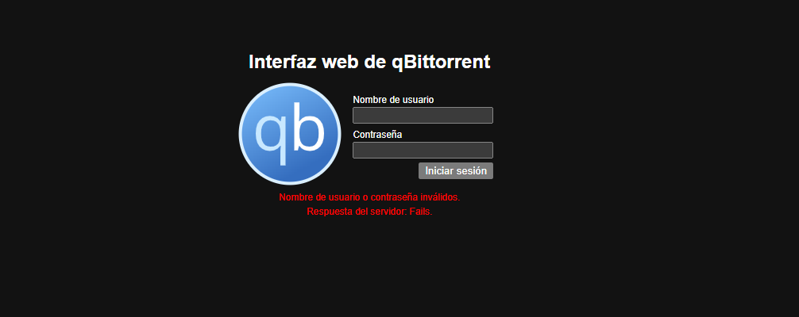

# 🔧 Troubleshooting - Problemas y Soluciones
Este documento detalla los problemas encontrados durante el desarrollo del proyecto y cómo los resolvimos.

## ❌ Problema 1: Problemas con podman-compose

Tuve un problema donde  `podman-compose --version`  no funcionaba en PowerShell y es uno de los requisitos principales para levantar contenedores.

### **Aquí está la solución:**

**Instalar podman-compose**

```powershell
pip install podman-compose
```

**Agregar al PATH**

El problema es que el directorio Scripts de Python no está en el PATH. Encontré mi ruta ejecutando:

```powershell
python -m site --user-site
```

Luego cambié site-packages por Scripts en esa ruta. Por ejemplo:

Si sale: 

**C:\Users\TuUsuario\AppData\Roaming\Python\Python311\site-packages**

Usa: 

**C:\Users\TuUsuario\AppData\Roaming\Python\Python311\Scripts**


**Para agregarlo al PATH permanentemente:**

1. Busca "Variables de entorno" en Windows
2. Editar la variable Path del usuario
3. Agregar la ruta del directorio Scripts
4. Reiniciar PowerShell

O agregar temporalmente en la sesión actual:

```powershell
$env:Path += ";C:\Users\TuUsuario\AppData\Roaming\Python\Python311\Scripts"
```

Verificar

```powershell
podman-compose --version
```

Alternativa

También se puede ejecutar directamente con Python sin modificar el PATH:

```powershell
python -m podman_compose --version
```

## ❌ Problema 2: "Nombre de usuario o contraseña inválidos" en qBittorrent

Al intentar acceder a la interfaz web de qBittorrent en http://localhost:8080, aparecía:

```
Nombre de usuario o contraseña inválidos.
Respuesta del servidor: Fails.  
```



Causa:
No sabíamos cuáles eran las credenciales por defecto. La imagen de LinuxServer/qBittorrent permite configurar usuario y contraseña mediante variables de entorno, pero si no se configuran correctamente, usa valores internos que desconocíamos.

Intentos fallidos:

- Probamos: admin/admin
- Probamos: admin/adminadmin
- Probamos las credenciales del archivo .env pero no funcionaban

Solución:

Revisé los logs del contenedor para encontrar pistas:

```powershell
podman logs centro-de-descargas
```

Descubrí que las variables de entorno estaban mal configuradas en el podman-compose.yml. Tenía:
```yml
environment:
  - WEBUI_USERNAME=${QB_USER}
  - WEBUI_PASSWORD=${QB_PASS}
```

Investigué la documentación de la imagen y descubrí que las variables correctas son con el prefijo  `QBT_ `
**Corregí el podman-compose.yml:**

```yml
environment:
  - QBT_WEBUI_USERNAME=${QB_USER}
  - QBT_WEBUI_PASSWORD=${QB_PASS}
```

Me aseguré de que mi archivo .env tuviera los valores correctos:

```env
envPUID=1000
PGID=1000
TZ=America/Lima
QB_USER=admin
QB_PASS=tu_contraseña_segura
```

Recreé el contenedor para aplicar los cambios:

```powershell
podman-compose down
podman-compose up -d
```

Ahora pude acceder con las credenciales definidas en el .env:

Usuario: admin  
Contraseña: adminadmin

Lección aprendida:
El prefijo correcto para las variables de entorno de qBittorrent en la imagen de LinuxServer es  `QBT_`, no solo  `WEBUI_`. Este tipo de detalles específicos de cada imagen se encuentran en su documentación oficial. Además, las variables de entorno deben estar definidas en el archivo  `.env`  para que podman-compose pueda leerlas correctamente.

## ❌ Problema 3: No aparecen resultados al buscar en qBittorrent
Tuvimos este problema al intentar buscar torrents para descargar


### Síntoma
Al intentar buscar torrents en qBittorrent:
- La búsqueda se queda cargando infinitamente
- Aparece el mensaje: "Search plugin is not installed"
- Jackett aparece en la lista de plugins pero no devuelve resultados
- Aparece error: "Connection failed" o "Timeout"

### Causa
qBittorrent no está correctamente conectado con Jackett. Esto puede pasar por:
- Los archivos  `jackett.py`  o  `jackett.json`  no están en la carpeta correcta
- La API Key de Jackett es incorrecta o está mal copiada
- La URL en  `jackett.json`  está mal configurada
- El contenedor de qBittorrent no se reinició después de agregar los archivos

### Solución

**Paso 1: Verificar que Jackett está corriendo**

```powershell
podman ps
```

Deberías ver `buscador-centro-de-descargas` en la lista. Si no está:

```powershell
podman-compose up -d
```

**Paso 2: Verificar que los archivos existen**

Abre el explorador de archivos y ve a:

```
configs\qbittorrent\qBittorrent\nova3\engines
```

Debes tener DOS archivos:
- `jackett.py`
- `jackett.json`

Si no están, descarga  `jackett.py`  desde: https://raw.githubusercontent.com/qbittorrent/search-plugins/master/nova3/engines/jackett.py

**Paso 3: Verificar el contenido de jackett.json**

Abre  `jackett.json`  con el bloc de notas. Debe verse así:

```json
{
    "api_key": "tu_api_key_real_aqui",
    "thread_count": 20,
    "tracker_first": false,
    "url": "http://jackett:9117"
}
```

**Verifica estos puntos:**

- ✅ La API Key debe ser la de tu Jackett (sin espacios ni saltos de línea)
- ✅ La URL debe ser exactamente `http://jackett:9117` (NO uses `localhost`)
- ✅ No debe tener errores de sintaxis (comas, llaves, comillas)

**Paso 4: Obtener la API Key correcta de Jackett**

1. Abre http://localhost:9117
2. En la esquina superior derecha, copia la API Key
3. Pégala en  `jackett.json`  reemplazando  `tu_api_key_real_aqui`

Ejemplo de API Key válida: `a1b2c3d4e5f6g7h8i9j0k1l2m3n4o5p6`

**Paso 5: Reiniciar qBittorrent**

Esto es CRÍTICO - sin reiniciar no cargará los cambios:

```powershell
podman restart centro-de-descargas
```

Espera 10 segundos.

**Paso 6: Verificar en qBittorrent**

1. Abre http://localhost:8080
2. Ve a la pestaña "Search" (Búsqueda)
3. Haz clic en "Search plugins..." (Plugins de búsqueda)
4. Deberías ver "Jackett" en la lista con estado "Enabled"

Si no aparece, haz clic en "Check for updates" (Buscar actualizaciones)

**Paso 7: Probar una búsqueda**

1. En el cuadro de búsqueda escribe algo simple como: `ubuntu`
2. Selecciona "Jackett" como motor de búsqueda
3. Haz clic en "Search"

Deberías ver resultados en menos de 10 segundos.

### Si aún no funciona

**Verificar los logs de qBittorrent:**

```powershell
podman logs centro-de-descargas
```

Busca mensajes de error relacionados con Jackett.

**Verificar los logs de Jackett:**

```powershell
podman logs buscador-centro-de-descargas
```

Deberías ver líneas como:

```
[Info] Jackett: Received search request
```

**Problema común: URL incorrecta**

Si usaste `http://localhost:9117` en lugar de `http://jackett:9117`, cámbialo:

```json
{
    "api_key": "tu_api_key",
    "thread_count": 20,
    "tracker_first": false,
    "url": "http://jackett:9117"
}
```

La razón: los contenedores se comunican usando nombres de red, no `localhost`.

**Recrear completamente la configuración:**

Si nada funciona, borra los archivos y empieza de nuevo:
```powershell
# Detener contenedores
podman-compose down

# Borrar la carpeta de configuración
Remove-Item -Recurse -Force .\configs\qbittorrent

#Volver a lanzar los contenedores con el script start.ps1
.\scripts/start.ps1

# Volver a crear
New-Item -ItemType Directory -Force -Path .\configs\qbittorrent

# Reiniciar contenedores
podman-compose up -d
```

Luego sigue los pasos de instalación desde el principio.

### Prevención

- Siempre reinicia qBittorrent después de modificar `jackett.json`
- Guarda la API Key en un lugar seguro
- Usa `http://jackett:9117` y NO `localhost` en la configuración

### Nota
La primera búsqueda puede tardar más porque Jackett está indexando. Las siguientes búsquedas serán más rápidas.